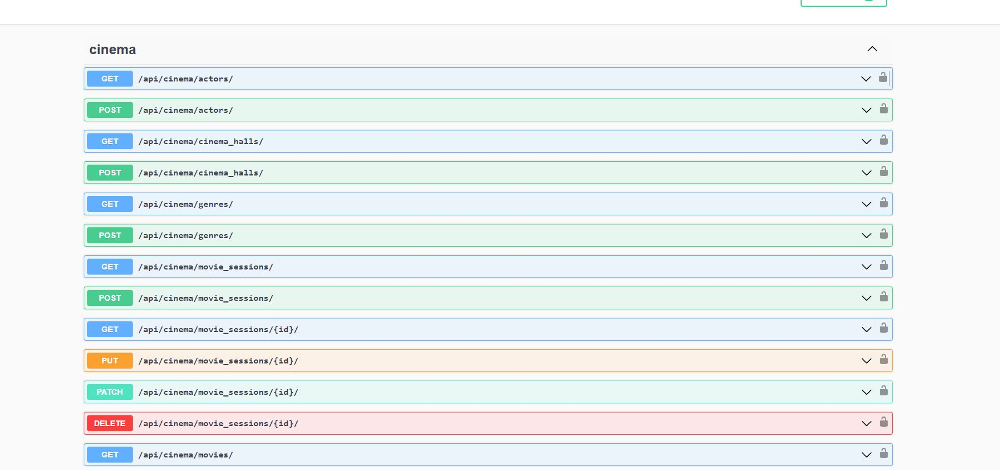

# CinemaAPI

Django REST project for managing cinema.

## Installing using GitHub

Install PostgresSQL and create db

```shell
git clone https://github.com/AlexBOVUKR/CinemaAPI
cd CinemaAPI
python3 -m venv venv
source venv/bin/activate(Mac)
source venv/Scripts/activate(Windows)
pip install -r requirements.txt
set DB_HOST=<your db hostname>
set DB_NAME=<your db name>
set DB_USER=<your db username>
set DB_PASSWORD=<your db user password>
set SECRET_KEY=<your secret key>
python manage.py migrate
python manage.py runserver #starts Django server
```

## Run with docker

Docker should be installed

```shell
docker-compose build
docker-compose up

ps. if not work on 0.0.0.0:8000 --> use 127.0.0.1:8000 instead
```

## Getting access

```shell
create user via /api/user/register/
get access token via /api/user/token/
```


## Features

* JWT authenticated
* Admin panel /admin/
* Documentation is located at api/doc/swagger/
* Managing orders and tickets
* Creating movies with actors and genres\
* Adding images to movies
* Creating cinema halls
* Adding movie sessions
* Filtering movie sessions and movies
* Custom permissions

## Demo
Swagger endpoints
